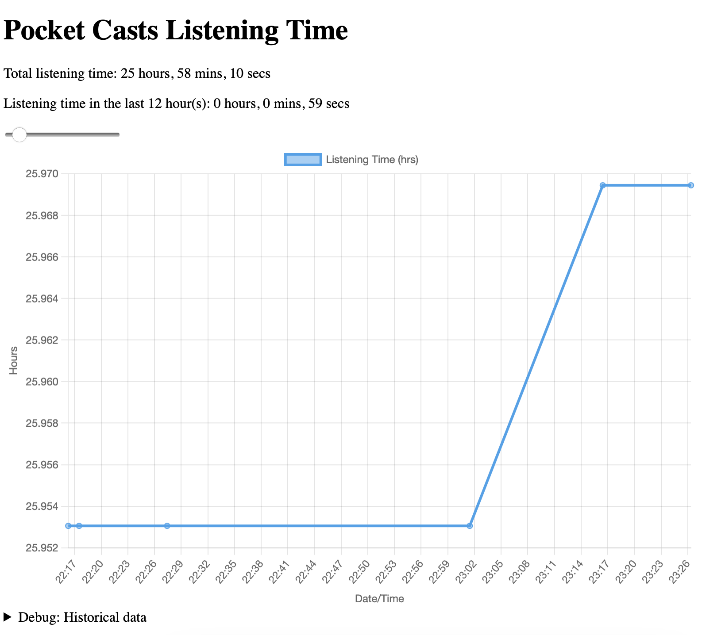

# Pocket Casts Listening Time
Basic Python web app to scrape the PocketCasts API to track listening time.

## Usecase
PocketCasts has a feature which shows the cumulative time listened but is not precise enough for tracking, for instance stating 1 day 2 hours instead of 1 day 2 hours 15 minutes 23 seconds. Their API exposes the cumulative seconds a user has accumulated, this is scraped whenever this web app is hit.

